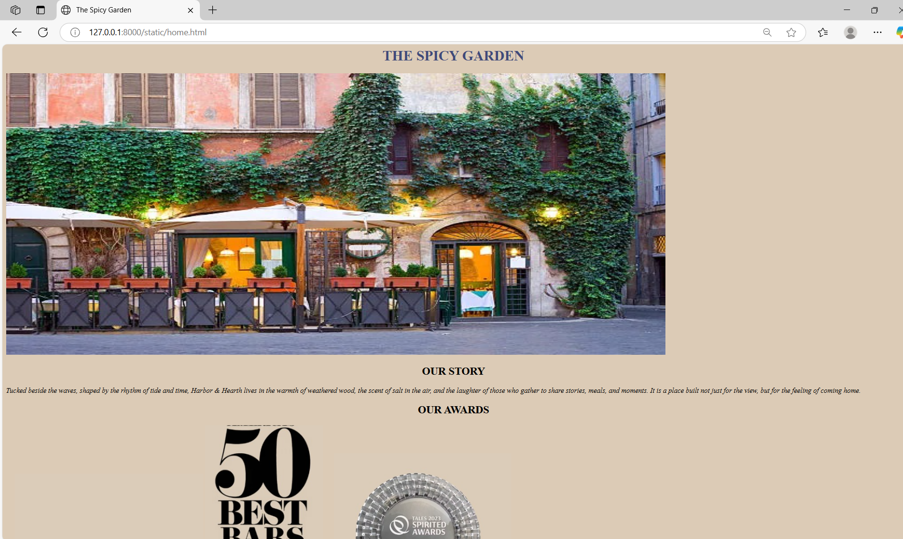
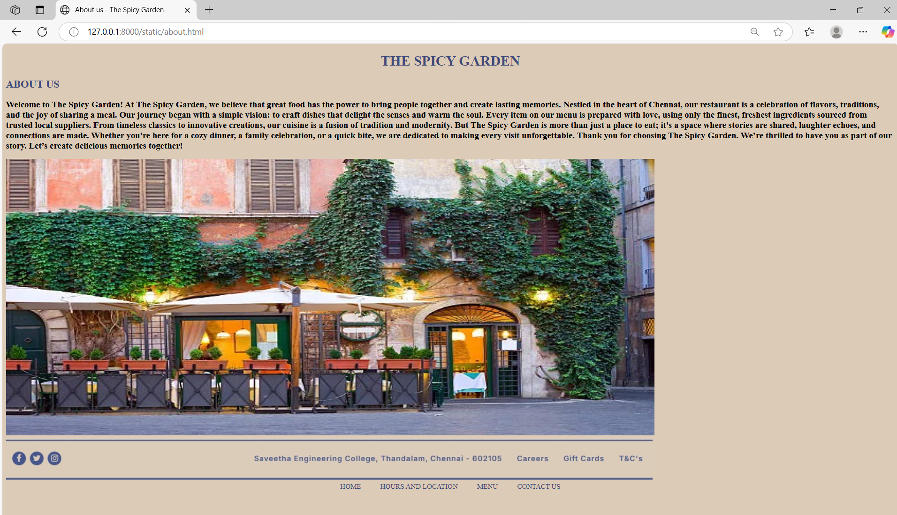
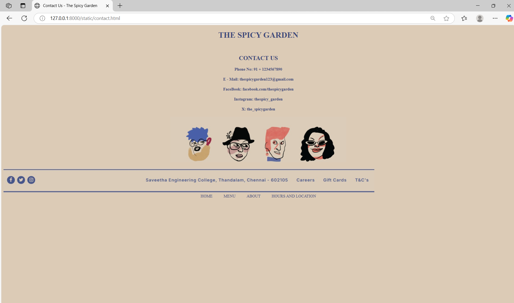
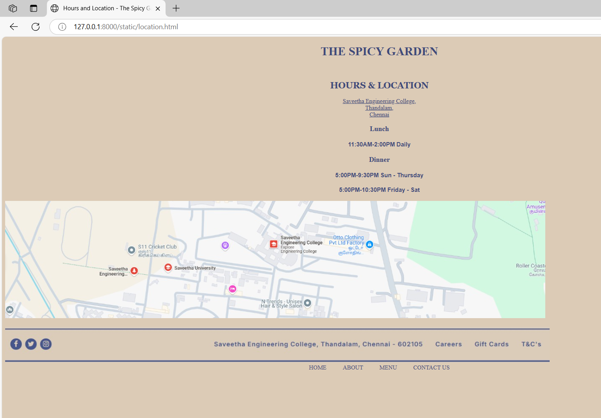
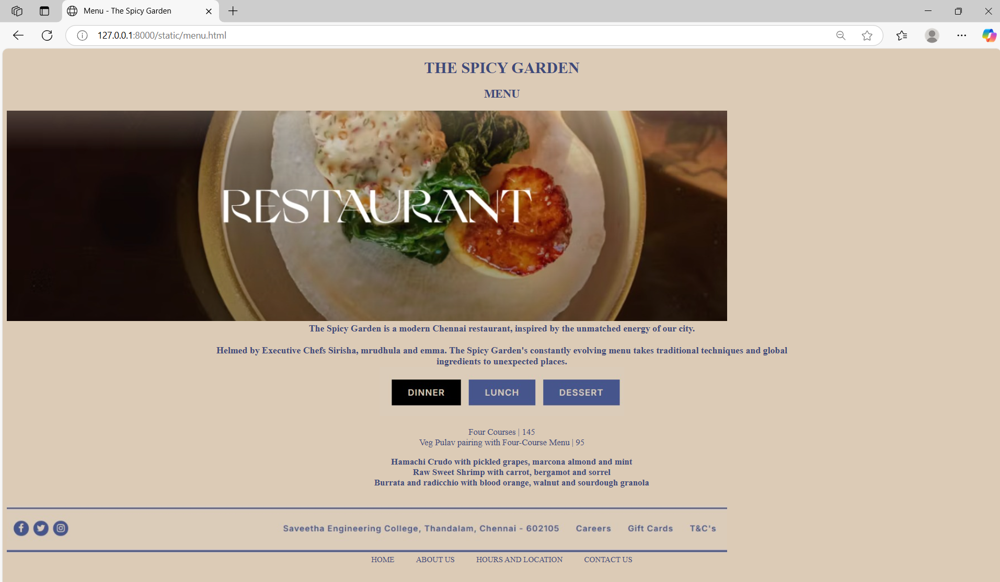

# Ex.07 Restaurant Website
## Date:
10-04-2025
## AIM:
To develop a static Restaurant website to display the food items and services provided by them.

## DESIGN STEPS:

### Step 1:
Requirement collection.

### Step 2:
Creating the layout using HTML and CSS.

### Step 3:
Updating the sample content.

### Step 4:
Choose the appropriate style and color scheme.

### Step 5:
Validate the layout in various browsers.

### Step 6:
Validate the HTML code.

### Step 7:
Publish the website in the given URL.

## PROGRAM:
Home

```html
<!DOCTYPE html>
<html lang="en">
<head>
    <meta charset="UTF-8">
    <meta name="viewport" content="width=device-width, initial-scale=1.0">
    <title>The Spicy Garden </title>
</head>
<body style="background-color: #dccbb6;">
    
    <h1 style="text-align: center; color: #3F4A7A;">THE SPICY GARDEN</h1>
    
    <h2 style="text-align: center;">OUR STORY</h2>
    <I style="text-align: center;" >Tucked beside the waves, shaped by the rhythm of tide and time, Harbor & Hearth lives in the warmth of weathered wood, the scent of salt in the air, and the laughter of those who gather to share stories, meals, and moments. It is a place built not just for the view, but for the feeling of coming home.</I>
    <h2 style="text-align: center;">OUR AWARDS</h2>
    
    

    
    
    <br>
    <br />
    <h2 style="text-align: center;">THE MOTIVE OF OUR RESTAURANT</h2>
    <B>To create a welcoming space where culinary excellence meets heartfelt hospitality. Our mission is to celebrate the art of food by serving dishes that honor tradition while embracing innovation. Through exceptional flavors, ethical sourcing, and an unforgettable dining experience, we aim to foster community connections and bring joy to every table.</B>
    <br />
    <br />
    
    <div style="text-align: center;">
        <a href="about.html" style="margin: 0 20px; text-decoration: none; color: #3F4A7A;">ABOUT US</a>
        <a href="location.html" style="margin: 0 20px; text-decoration: none; color: #3F4A7A;">HOURS AND LOCATION</a>
        <a href="menu.html" style="margin: 0 20px; text-decoration: none; color: #3F4A7A;">MENU</a>
        <a href="contact.html" style="margin: 0 20px; text-decoration: none; color: #3F4A7A;">CONTACT US</a>

    </div>
      
      
</body>
</html>
```
About
```html
<!DOCTYPE html>
<html lang="en">
<head>
    <meta charset="UTF-8">
    <meta name="viewport" content="width=device-width, initial-scale=1.0">
    <title>About us - The Spicy Garden</title>
</head>
<body bgcolor="#dccbb6">
    <h1 style="text-align: center; color: #3F4A7A;">THE SPICY GARDEN</h1>
    <H2 style="color: #3F4A7A;">ABOUT US</H2>
    <b style="font-size: 20px;">Welcome to The Spicy Garden!

        At The Spicy Garden, we believe that great food has the power to bring people together and create lasting memories. Nestled in the heart of Chennai, our restaurant is a celebration of flavors, traditions, and the joy of sharing a meal.
        
        Our journey began with a simple vision: to craft dishes that delight the senses and warm the soul. Every item on our menu is prepared with love, using only the finest, freshest ingredients sourced from trusted local suppliers. From timeless classics to innovative creations, our cuisine is a fusion of tradition and modernity.
        
        But The Spicy Garden is more than just a place to eat; it's a space where stories are shared, laughter echoes, and connections are made. Whether you're here for a cozy dinner, a family celebration, or a quick bite, we are dedicated to making every visit unforgettable.
        
        Thank you for choosing The Spicy Garden. We’re thrilled to have you as part of our story. Let’s create delicious memories together!</b>
        <br />
        <BR />
                

        
    
        </div>
        
        
        <br />
        <div style="text-align: center;">
            <a href="home.html" style="margin: 0 20px; text-decoration: none; color: #3F4A7A;">HOME</a>
            <a href="location.html" style="margin: 0 20px; text-decoration: none; color: #3F4A7A;">HOURS AND LOCATION</a>
            <a href="menu.html" style="margin: 0 20px; text-decoration: none; color: #3F4A7A;">MENU</a>
            <a href="contact.html" style="margin: 0 20px; text-decoration: none; color: #3F4A7A;">CONTACT US</a>
</body>
</html>
```

contact

```html
<!DOCTYPE html>
<html lang="en">
<head>
    <meta charset="UTF-8">
    <meta name="viewport" content="width=device-width, initial-scale=1.0">
    <title>Contact Us - The Spicy Garden</title>
</head>
<body style="background-color: #dccbb6;">
    <h1 style="text-align: center; color: #3F4A7A;">THE SPICY GARDEN</h1>
    <br />
    <h2 style="text-align: center; color: #3F4A7A;">CONTACT US</h2>
    <h4 style="text-align: center; color: #3F4A7A;">Phone No: 91 + 1234567890</h3>
    <h4 style="text-align: center; color: #3F4A7A;">E - Mail: thespicygarden123@gmail.com</h3>
    <h4 style="text-align: center; color: #3F4A7A;">FaceBook: facebook.com/thespicygarden</h3>
    <h4 style="text-align: center; color: #3F4A7A;">Instagram: thespicy_garden</h3>
    <h4 style="text-align: center; color: #3F4A7A;">X: the_spicygarden</h3>

            
            
            <div style="text-align: center;">
                
            </div>
            <br />
            <div>
                
            </div>

            <div style="text-align: center;">
                <a href="home.html" style="margin: 0 20px; text-decoration: none; color: #3F4A7A;">HOME</a>
                <a href="menu.html" style="margin: 0 20px; text-decoration: none; color: #3F4A7A;">MENU</a>
                <a href="about.html" style="margin: 0 20px; text-decoration: none; color: #3F4A7A;">ABOUT</a>
                <a href="location.html" style="margin: 0 20px; text-decoration: none; color: #3F4A7A;">HOURS AND LOCATION</a>
        
            </div>
</body>
</html>
```

Location
```html
<!DOCTYPE html>
<html lang="en">
<head>
    <meta charset="UTF-8">
    <meta name="viewport" content="width=device-width, initial-scale=1.0">
    <title>Hours and Location - The Spicy Garden</title>
</head>
<body style="background-color: #dccbb6;">
    <h1 style="text-align: center; color: #3F4A7A;">THE SPICY GARDEN</h1>
    <br />
    <h2 style="text-align: center; color: #3F4A7A; font-family: Georgia, 'Times New Roman', Times, serif;">HOURS & LOCATION</h2>
    <div style="text-align: center; color: #3F4A7A;">
        <a href="https://www.google.com/maps/@13.0285804,80.0189504,17z?entry=ttu&g_ep=EgoyMDI1MDQyNy4xIKXMDSoASAFQAw%3D%3D" style="color: #3F4A7A;">Saveetha Engineering College, <br>Thandalam, <br>Chennai</a>

    </div>
    <h3 style="text-align: center; color: #3F4A7A;">Lunch</h3>
    <h4 style="text-align: center; color: #3F4A7A; font-family: Arial, Helvetica, sans-serif;">11:30AM-2:00PM Daily</h4>
    <h3 style="text-align: center; color: #3F4A7A;">Dinner</h3>
    <h4 style="text-align: center; color: #3F4A7A; font-family: Arial, Helvetica, sans-serif;">5:00PM-9:30PM Sun - Thursday</h4>
    <h4 style="text-align: center; color: #3F4A7A; font-family: Arial, Helvetica, sans-serif;">5:00PM-10:30PM Friday - Sat</h4>
<div>
    
</div>
<br />


<div style="text-align: center;">
    <a href="home.html" style="margin: 0 20px; text-decoration: none; color: #3F4A7A;">HOME</a>
    <a href="about.html" style="margin: 0 20px; text-decoration: none; color: #3F4A7A;">ABOUT</a>
    <a href="menu.html" style="margin: 0 20px; text-decoration: none; color: #3F4A7A;">MENU</a>
    <a href="contact.html" style="margin: 0 20px; text-decoration: none; color: #3F4A7A;">CONTACT US</a>


</body>
</html>
```
Menu
```html
<!DOCTYPE html>
<html lang="en">
<head>
    <meta charset="UTF-8">
    <meta name="viewport" content="width=device-width, initial-scale=1.0">
    <title>Menu - The Spicy Garden</title>
</head>
<body style="background-color: #dccbb6;">
    <h1 style="text-align: center; color: #3F4A7A;">THE SPICY GARDEN</h1>
    <h2 style="text-align: center; color: #3F4A7A;">MENU</h1>
    <div>
        
    </div>
    <div style="text-align: center; font-size: 19px;">
       <b style="color: #3F4A7A; text-align: center;">
        The Spicy Garden is a modern Chennai restaurant, inspired by the unmatched energy of our city. <br>
        <br />
        Helmed by Executive Chefs Lakshmidhar, Naren and Vignesh. The Spicy Garden's constantly evolving menu takes traditional techniques and global<br>ingredients to unexpected places.
    </b> 
    </div>
    <div style="text-align: center;">
        
        <p style="color: #3F4A7A; text-align: center;font-size: 18px;">
            Four Courses | 145
            <br>
            Veg Pulav pairing with Four-Course Menu | 95
        </p>
        <ul>
        <b style="color: #3F4A7A; text-align: center;font-size: 18px;">
            Hamachi Crudo with pickled grapes, marcona almond and mint
        </b>
        <br />
        
        <div><b style="color: #3F4A7A; text-align: center;font-size: 18px;">
            Raw Sweet Shrimp with carrot, bergamot and sorrel</b></div>

            <div><b style="color: #3F4A7A; text-align: center;font-size: 18px;">
                Burrata and radicchio with blood orange, walnut and sourdough granola</b></div>
        </ul>
    </div>
    <br />
    <div>
        
    </div>

    <div style="text-align: center;">
        <a href="home.html" style="margin: 0 20px; text-decoration: none; color: #3F4A7A;">HOME</a>
        <a href="about.html" style="margin: 0 20px; text-decoration: none; color: #3F4A7A;">ABOUT US</a>
        <a href="location.html" style="margin: 0 20px; text-decoration: none; color: #3F4A7A;">HOURS AND LOCATION</a>
        <a href="contact.html" style="margin: 0 20px; text-decoration: none; color: #3F4A7A;">CONTACT US</a>

    </div>
</body>
</html>
```
## OUTPUT:
Home


About


Contact


Location


Menu


## RESULT:
The program for designing software company website using HTML and CSS is completed successfully.
